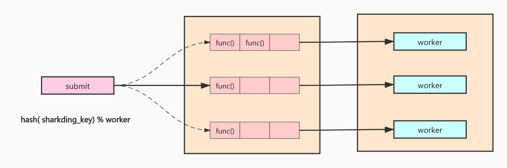

# go-gearman

The shardingkey is hashed to the same queue, each of which is bound to a worker.



## Usage

**init gearman**

```go
gm := gearman.NewGearman(workerNum, queueSize, SetIdleTimeout(1 * time.Minute), SetExceptionCall(func(error)))
```

**start/stop**

```go
gm.Start()
defer gm.Stop()
```

**Submit**

```go
gm.Submit(shardingKey, func() error)
```

## Example

```go
package main

import (
	"fmt"
	"sync"

	"github.com/rfyiamcool/go-gearman"
)

func main() {
	gm := gearman.NewGearman(10, 1000)
	gm.Start()
	defer gm.Stop()

	var (
		wg    = sync.WaitGroup{}
		count = 1000000 // 100w
	)

	wg.Add(count)

	cb := func() error {
		wg.Done()
		return nil
	}
	for i := 0; i < count; i++ {
		gm.Submit(fmt.Sprintf("id-%v", i), cb)
	}
	wg.Wait()
}
```